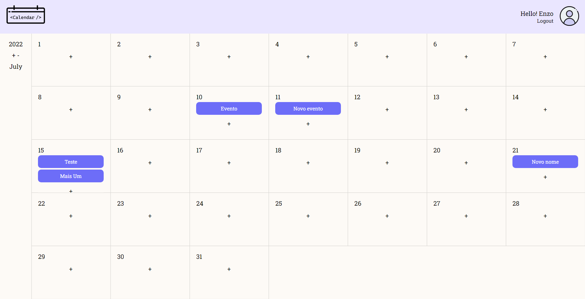
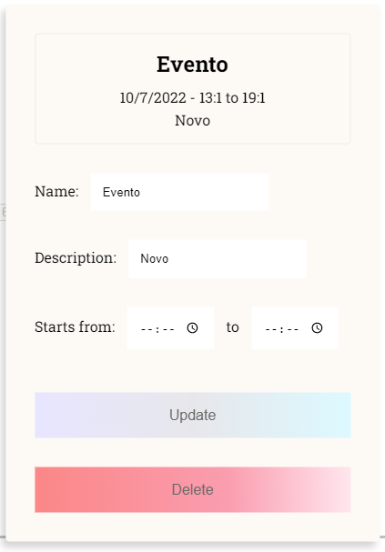
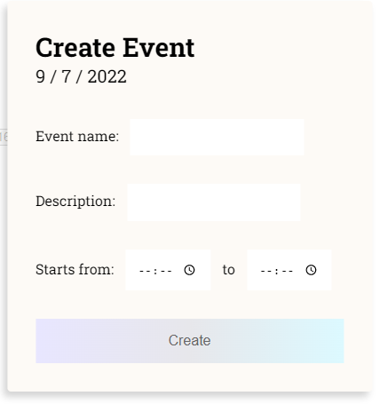

# Desafio Tecnico Tokenlab

Solução para o desafio Técnico para vaga de estágio na Tokenlab.

## Ferramentas e recursos utilizados para a solução:

### BackEnd ↓

- Arquitetura: Api REST
- Principal: Node.JS (Javascript)
- Database: MongoDB
- Dependecias: Express, Mongoose, jsonwebtoken, bcrypt
- Autenticação via JWT
- Criptografia de senhas HASH
- Storage e upload via Multer

### FrontEnd ↓

- Componetização: React
- Rotas e direcionamento com React Router
- Estilização CSS3
- Tratamento de 'Date' com Date-fns

### Preview:

Novo Estilo(v2)(Em desenvolvimento):

- Estilo calendario:

- Estilo dos Modais:

