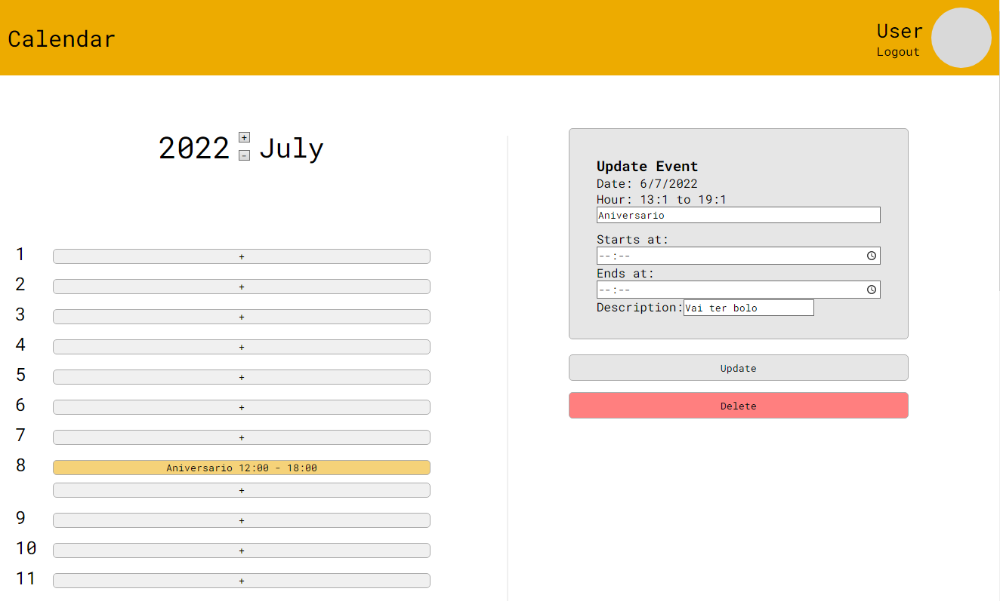

# Desafio Tecnico Tokenlab

Solução para o desafio Técnico para vaga de estágio na Tokenlab.

## Ferramentas e recursos utilizados para a solução:

### BackEnd ↓

- Arquitetura: Api REST
- Principal: Node.JS (Javascript)
- Database: MongoDB
- Dependecias: Express, Mongoose, jsonwebtoken, bcrypt

Outras informações:

- Autenticação via JWT
- Criptografia de senhas HASH

### FrontEnd ↓

- Componetização com React
- Rotas e direcionamento com React Router
- Estilização CSS3
- Tratamento de 'Date' com Date-fns

### Preview:

