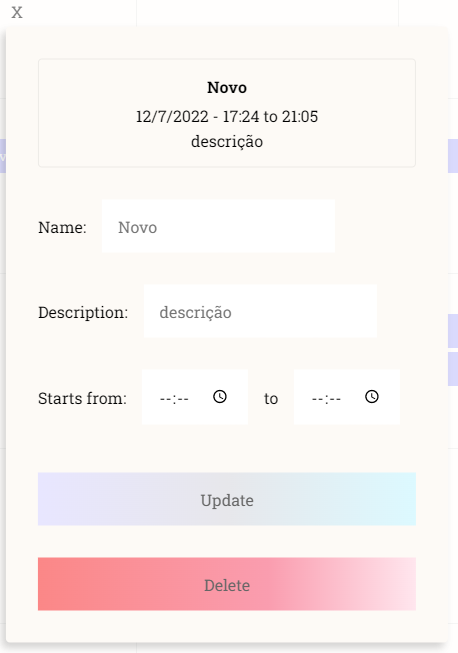
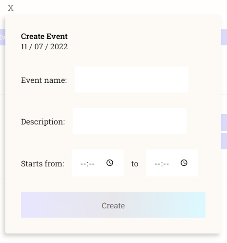

- Translation Portuguese: [Tradução PT_BR](translation_PTBR.md)

# Calendar with event scheduler

Web app that generates a calendar that can schedule events on chosen days.

## Libraries and technologies used:

### BackEnd ↓

- Main: Node.JS (Javascript)
- Arch: Api REST
- Database: MongoDB
- Libs: Express, Mongoose, jsonwebtoken, bcrypt
- JWT authentication
- HASH-based Cryptography
- Storage e upload with Multer

### FrontEnd ↓

- Main: React
- Routes and redirect with React Router
- Styles CSS Modules
- Dates with Date-fns

### Layout preview:

New Style(v2):

- Page layout:
 -  

- Modals style:
 - 
 - 
